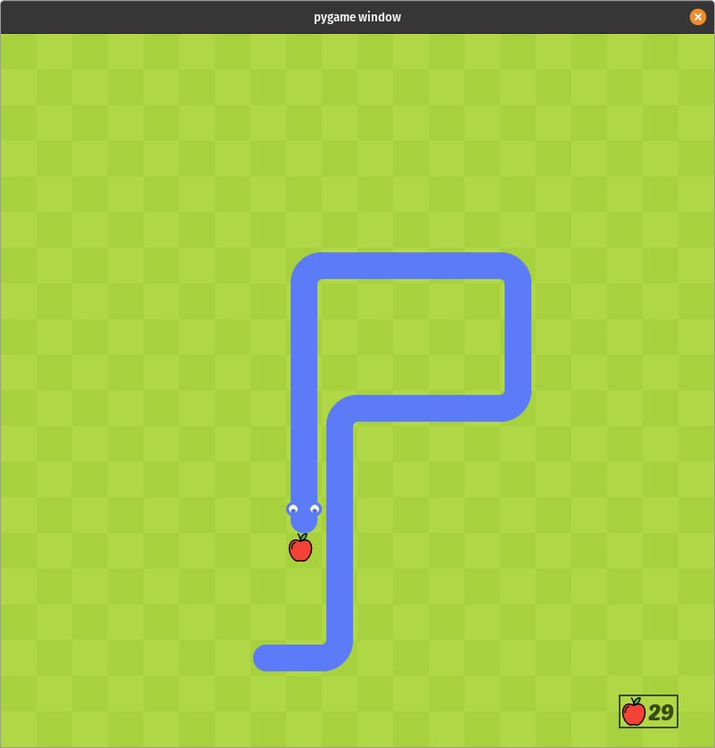
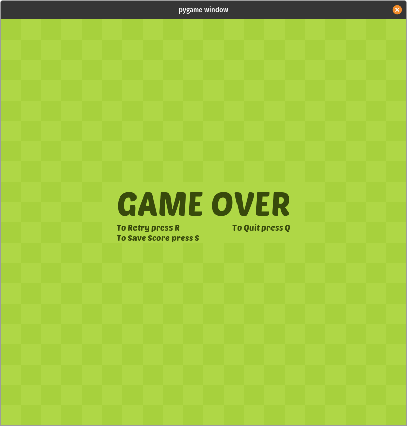
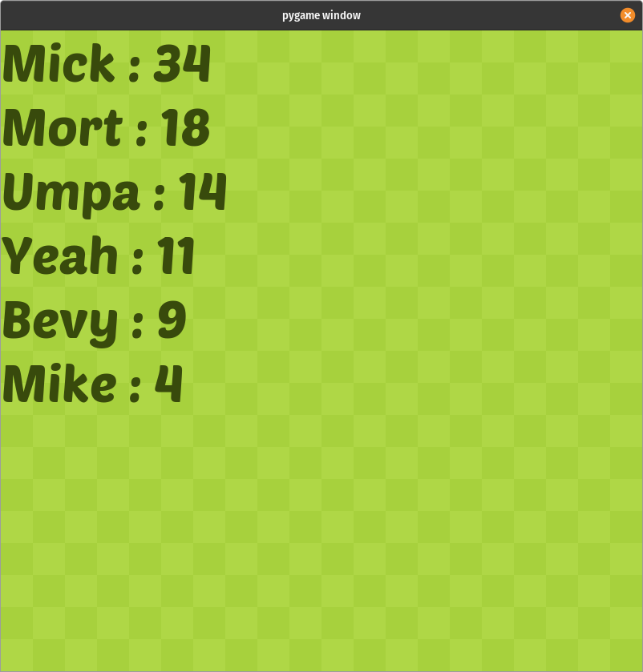

# Snake 

The famous game "Snake".

This project was built as an exercise to learn pygame.

Hope you enjoy my game   🐍

---

### A quick look of the game

---

### Originally Inspired Disclaimer

The way this project looks was inspired by the tutorial of github user clear-code-projects.

The tutorial is here: https://www.youtube.com/watch?v=QFvqStqPCRU

The pics/images and sounds are mostly taken from his github:
github.com/clear-code-projects/Snake
